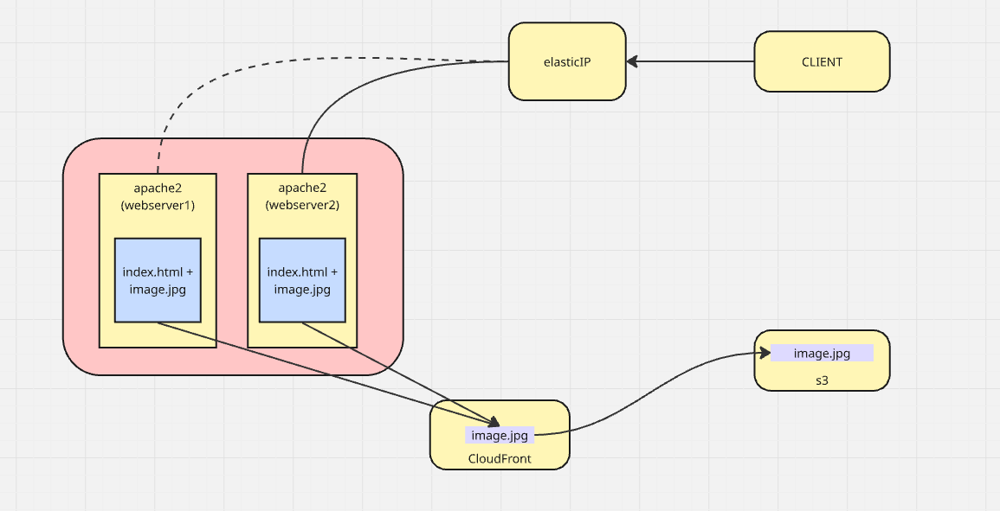

# 📦 TBC პრაქტიკული დავალება

## 📚 სარჩევი

- [Architecture](#architecture)
- [Infrastructure Details](#Infrastructure)
- [Variables](#variables)

## 🏗️ Architecture

- Diagram 

- EC2 instances - ჰოსტავენ სტატიკურ index.hmtl ფაილს apache2 სერვისის დახმარებით. index.html შეიცავს რეფერენს  Cloudfront-ის URL-ზე სურათის წამოსაღებად.
- S3 bucket - ადგილი სადაც სურათი ინახება, წვდომადია მხოლოდ CloudFront-დან (OAC)
- CloudFront - მოაქვს სურათი, ქეშავს და აწვდის ევბსერვერს
- Elastic IP - ქმნის სტატიკურ მისამართს ერთ-ერთი ვებსერვერისთვის.

## 🛠️ .tf ფაილები

- main.tf
  ქმნის ec2 რესურსებს, რომლების user_data პარამეტრის დახმარებით კონტეინერში აინსტალირებენ და სტარტავენ apache2 სერვისს და აგენერირებენ index.html ფაილს.
  '''    user_data = <<-EOF
              #!/bin/bash
              set -x
              exec > /var/log/user-data.log 2>&1
              apt update -y
              apt install -y apache2
              mkdir -p /var/www/html
              echo "<html><body><h1>Web1</h1>
              
              </body></html>" | tee /var/www/html/index.html > /dev/null
              chown www-data:www-data /var/www/html/index.html
              systemctl enable apache2
              systemctl start apache2
              EOF
  
- 1x S3 bucket
- 1x CloudFront distribution
- 1x Elastic IP
- Security Groups 
